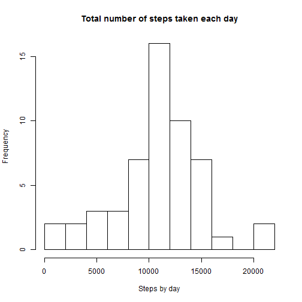
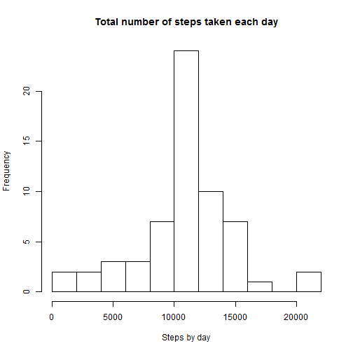
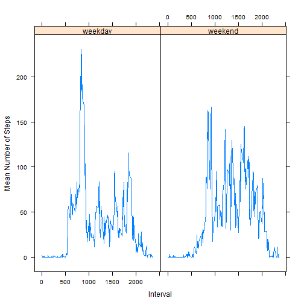

  
Reproducible Research: Peer Assessment 1
======

## Loading and preprocessing the data

1. Load the data:


```r
data1 <- read.csv("activity.csv", header=TRUE)
```

2. Process the data: The date column in the dataset is converted to Date format


```r
data1$dates <- as.Date(data1$date)
```

## What is mean total number of steps taken per day?

1. Histogram of the total number of steps taken each day:


```r
library(dplyr)
data2 <- group_by(data1, dates)
data3 <- summarize(data2, stepsByDay=sum(steps))
hist(data3$stepsByDay, 10, main="Total number of steps taken each day", xlab="Steps by day")
```

 

2. Calculate and report the mean and median total number of steps taken per day


```r
Mean <- mean(data3$stepsByDay, na.rm=TRUE)
Median <- median(data3$stepsByDay, na.rm=TRUE)
```

The mean total number of steps taken per day is 10766.19. The median corresponds to 10765.
  
## What is the average daily activity pattern?

1. Make a time series plot (i.e. type = "l") of the 5-minute interval (x-axis) and the average number of steps taken, averaged across all days (y-axis)


```r
data4 <- group_by(data1, interval)
data5 <- summarize(data4, meanStepsByInt=mean(steps, na.rm=TRUE))
with(data5, plot(interval, meanStepsByInt, type="l", xlab="Interval", ylab="Mean Number of Steps"))
```

 

2. Which 5-minute interval, on average across all the days in the dataset, contains the maximum number of steps?


```r
maxStepsByInt <- data5[which.max(data5$meanStepsByInt), "interval"]
```

The 5-minute interval that contains the maximum number of steps is 835.
  
## Imputing missing values

1. Calculate and report the total number of missing values in the dataset (i.e. the total number of rows with NAs)


```r
totalRowsNoNAs <- length(complete.cases(data1)) - sum(complete.cases(data1))
```

The total number of rows with NAs in the dataset is 2304.

2. Devise a strategy for filling in all of the missing values in the dataset. The strategy does not need to be sophisticated. For example, you could use the mean/median for that day, or the mean for that 5-minute interval, etc.

3. Create a new dataset that is equal to the original dataset but with the missing data filled in.


```r
data1fill <- data1
nas <- which(is.na(data1$steps))
for (i in nas){ 
  data1fill[i, "steps"] <- data5[which(data5[,"interval"] == data1[i, "interval"]), "meanStepsByInt"] 
}
```


4. Make a histogram of the total number of steps taken each day and Calculate and report the mean and median total number of steps taken per day. Do these values differ from the estimates from the first part of the assignment? What is the impact of imputing missing data on the estimates of the total daily number of steps?


```r
data2fill <- group_by(data1fill, dates)
data3fill <- summarize(data2fill, stepsByDay=sum(steps))
hist(data3fill$stepsByDay, 10, main="Total number of steps taken each day", xlab="Steps by day")
```

 

```r
MeanFill <- mean(data3fill$stepsByDay, na.rm=TRUE)
MedianFill <- median(data3fill$stepsByDay, na.rm=TRUE)
```

The mean total number of steps taken per day is 10766.19. The median corresponds to 10766.19. The mean total number of steps taken per day do not differ from the estimates from the first part of the assignment, but the median does. The median goes from 10765 to 10766.19. Furthermore, now the median is equal to the mean in the NAs-filled dataset.

## Are there differences in activity patterns between weekdays and weekends?

1. Create a new factor variable in the dataset with two levels -- "weekday" and "weekend" indicating whether a given date is a weekday or weekend day.


```r
data1fill <- mutate(data1fill, dayType="weekday")
for (i in 1:nrow(data1fill)){
  if(weekdays(data1fill[i, "dates"]) =="Saturday" | weekdays(data1fill[i, "dates"])=="Sunday") 
    data1fill[i, "dayType"] <- "weekend"
}
```

2. Make a panel plot containing a time series plot (i.e. type = "l") of the 5-minute interval (x-axis) and the average number of steps taken, averaged across all weekday days or weekend days (y-axis)


```r
data4fill <- group_by(data1fill, interval, dayType)
data5fill <- summarize(data4fill, meanStepsByDayType=mean(steps))
library(lattice)
xyplot(meanStepsByDayType ~ interval | dayType, data=data5fill, type='l', xlab="Interval", ylab="Mean Number of Steps")
```

 


